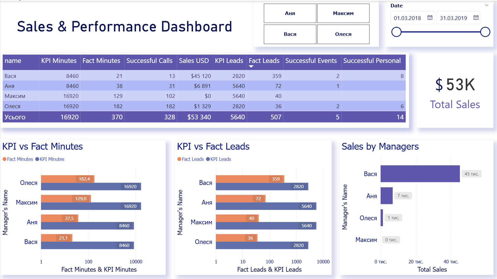

# Sales & Performance Dashboard (Power BI + Python API)

## Project Overview

This repository contains a complete analytical solution developed as a technical test assignment.  
The project combines **Power BI analytics**, **Python backend development**, and **external data integration**.

The solution includes:
- A Power BI dashboard with KPI, sales, and call performance analytics
- A Python (Flask) API service for updating currency exchange rates
- Google Sheets as a dynamic data source for currency rates
- End-to-end integration between Python API, Google Sheets, and Power BI

---

## Repository Structure

```text
├── app.py                             # Flask app for updating USD/UAH exchange rates
├── README.md                          # Project documentation
├── Sales_Performance_Dashboard.pbix   # Power BI dashboard file
├── requirements/                      # Python dependencies (requirements.txt or folder)
├── .gitignore                         # Git ignore rules
├── power_bi_dashboard.png             # Screenshot of Power BI dashboard
└── Maxidtp_TechTask_PowerBI_Python_v2.xlsx  # Technical assignment and dataset
```

### Files Description

- **app.py** — Flask application for updating USD/UAH currency rates
- **requirements** — Python dependencies required to run the API
- **power_bi_dashboard.png.png** — Screenshot of the final Power BI dashboard
- **Тестове завдання maxidtp (Power BI, POST, python)_v2.xlsx** — Source dataset used for Power BI modeling
- **.gitignore** — Excludes credentials and cache files from version control

---

## Power BI Dashboard

The Power BI report provides performance analytics by manager and includes the following metrics:

- KPI Minutes vs Actual Call Minutes
- KPI Leads vs Actual Leads
- Successful Calls
- Sales Amount converted to USD
- Successful Events deals
- Successful Personal deals

### Dashboard Features

- Interactive **date slicer**
- KPI calculations based on **working days**
- Currency conversion using **daily USD/UAH rates**
- Star-schema data model (fact and dimension tables)
- Manager-level performance comparison

### Dashboard Preview



---

## Currency Update Service (Python)

A Python API service built with **Flask** is used to update USD/UAH exchange rates.

### Key Features

- Accepts date range parameters:
  - `update_from`
  - `update_to`
- Date format: `yyyy-mm-dd`
- Default behavior: both dates equal the current date
- Uses the **National Bank of Ukraine (NBU) public API**
- Automatically handles missing dates by using the latest available rate
- API key authorization
- Writes data directly into Google Sheets

---

## API Usage

### Endpoint

GET /update


### Headers

| Header      | Value     |
|------------|-----------|
| X-API-KEY  | SECRET123 |

### Query Parameters

| Parameter    | Description                   |
|-------------|-------------------------------|
| update_from | Start date (yyyy-mm-dd)       |
| update_to   | End date (yyyy-mm-dd)         |

### Example Request

GET /update?update_from=2023-01-02&update_to=2023-01-08

---

## Google Sheets (Currency Rates)

The updated currency rates are stored in a Google Sheet.

🔗 **Public Google Sheet with USD/UAH rates:**  
https://docs.google.com/spreadsheets/d/1Ns-Oundghc1vtwIEEWIHLtCtkGJEUk__jKJoqa_wRQA/edit?usp=sharing

---

## Dataset

The dataset used for this project is provided as an Excel file:

- **Тестове завдання maxidtp (Power BI, POST, python)_v2.xlsx**

The file contains:
- CRM leads data
- Call data
- KPI reference tables
- Manager and pipeline dimensions

This file is included in the repository to allow full verification of the solution.

---

## Technologies Used

- **Power BI**
- **Python 3**
- **Flask**
- **Google Sheets API**
- **gspread**
- **REST API**
- **Postman** (for testing)

---

## Author & Contacts

**Oleksii Kunytskyi**

- 📊 Tableau Portfolio:  
  https://public.tableau.com/app/profile/kunytskyi.oleksii/vizzes

- 📄 Resume:  
  https://drive.google.com/file/d/1p-4zgsXfoiIHE7lGxoN4dXzqnGC9MVFQ/view?usp=sharing

- 💼 LinkedIn:  
  https://www.linkedin.com/in/datapulse/

- ✉️ Email:  
  kunytskyi.data@gmail.com
